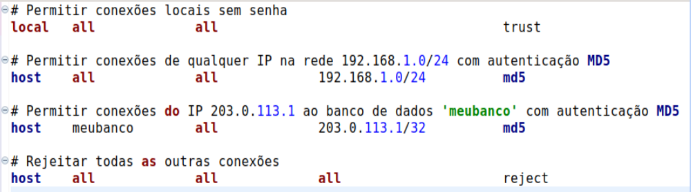
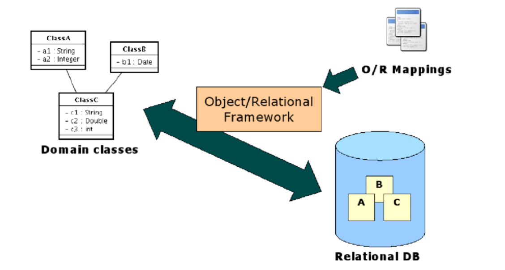
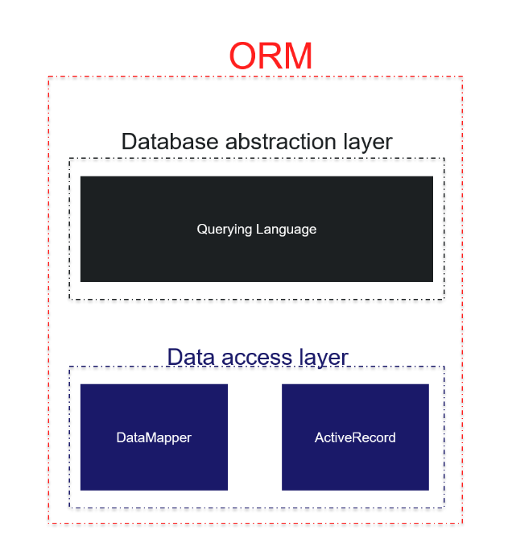
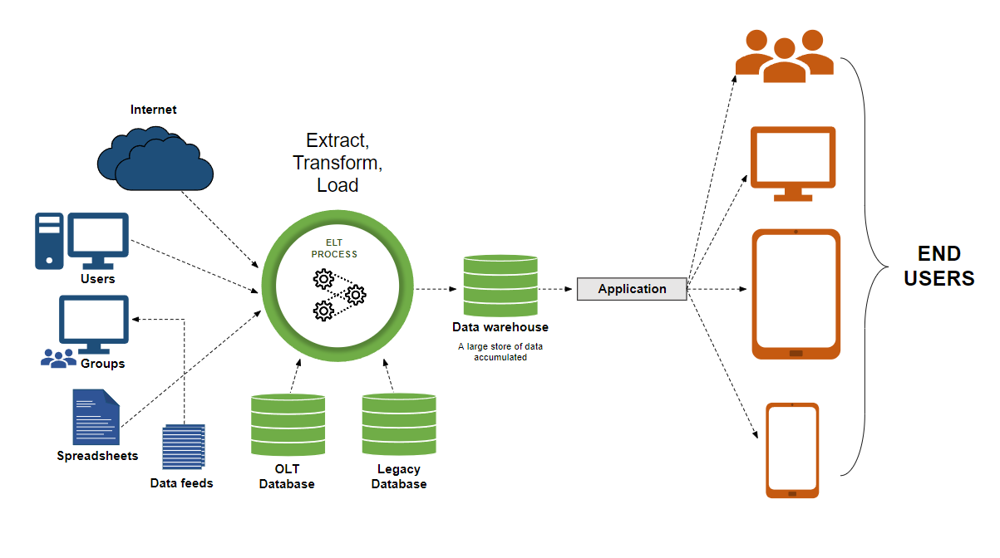
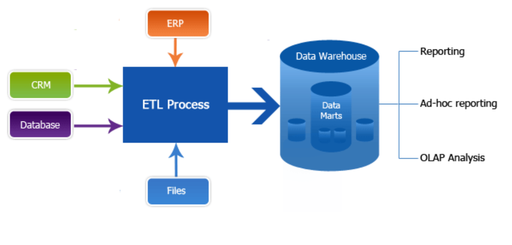
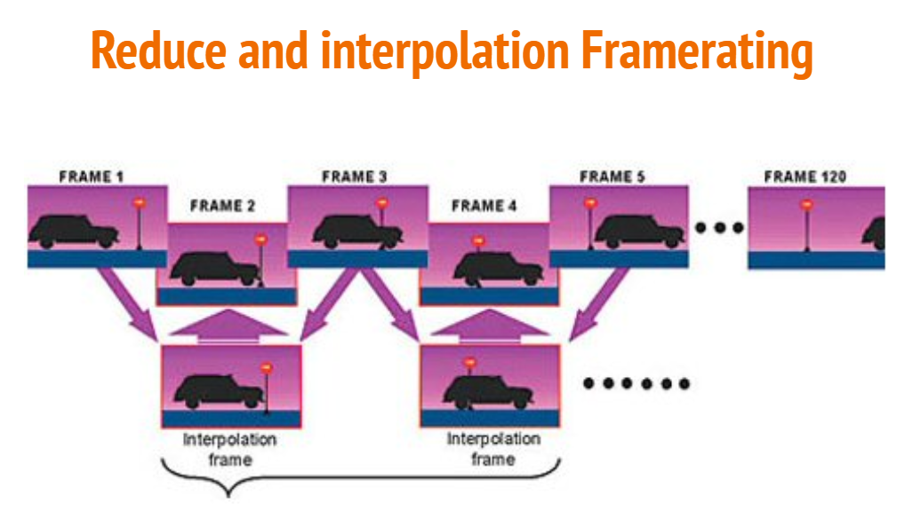

# Catálogo de SGBD

> conjunto de tabelas que armazena a estrutura de banco de dados

### Principais components:

> Tabelas, esquemas, índices, tipos de dados, funções, armazenados nas classes:

> sql pg_class, pg_tables, pg_indexes, pg_type

```sql

SELECT * FROM pg_tables WHERE schemaname = 'public';


```

## Administração de SGBD: Controle de Acesso

> Controle de acesso envolve gerenciar quem pode acessar e manipular dados no banco.

> Métodos: ACLs (Access Control Lists), GRANT e REVOKE comandos.

```sql

ALTER DEFAULT PRIVILEGES IN SCHEMA nome_do_esquema GRANT SELECT ON TABLES TO nome_do_papel;


```

## Administração de Usuários no PostgreSQL

```sql


  CREATE USER nome_do_usuario WITH PASSWORD 'senha';


  ALTER USER nome_do_usuario WITH PASSWORD 'nova_senha';


  DROP USER nome_do_usuario;


  GRANT SELECT ON tabela TO nome_do_usuario;


```

## Administração de Papéis no PostgreSQL

> Papéis são conjuntos de permissões que podem ser atribuídos aos usuários.

```sql


CREATE ROLE nome_do_papel;

GRANT nome_do_papel TO nome_do_usuario;

REVOKE nome_do_papel FROM nome_do_usuario;


```

## Administracao de provilegios

```sql

GRANT SELECT, INSERT ON tabela TO nome_do_papel;


```

> ## Revogacao de Direitos

```sql

REVOKE SELECT ON tabela FROM nome_do_usuario;


```

> Utilização de `pg_hba.conf` para Controle de Acesso a Nível de Conexão

> O pg_hba.conf é o arquivo de configuração de Host-Based Authentication (HBA) do PostgreSQL.

> Define quais usuários podem se conectar, de quais hosts e com quais métodos de autenticação.

> Utilização de `pg_hba.conf` para Controle de Acesso a Nível de Conexão

#### Estrutura do Arquivo:

> Tipo de Conexão: `local`, `host`, `hostssl`, `hostnossl`

> Banco de Dados: Nome do banco de dados ou `all`

> Usuário: Nome do usuário ou `all`

> Endereço: Endereço IP ou sub-rede
> (apenas para tipos `host`)

> Método: Método de autenticação (`md5`, `password`, `trust`, `reject`, etc.)



#### Metodologia de Autenticação Comum:

> `trust`: Conexões são permitidas sem senha.

> `md5` : Utiliza MD5 para encriptar senhas.

> `password`: Senha é enviada em texto plano.

> `reject`: Rejeita todas as conexões correspondentes.

#### Melhores Práticas:

> Utilize sub-redes específicas em vez de permitir conexões de qualquer IP.

> Combine métodos de autenticação robustos como `md5` ou `scram-sha-256`

> Mantenha o arquivo organizado e documentado para fácil manutenção.

## Backup e Recuperação no PostgreSQL

### Tipos de backup

> Lógico: O backup lógico consiste em exportar os dados do banco de dados em um formato legível (geralmente SQL), que pode ser importado em um banco de dados.

> `pg_dump` -U nome_do_usuario -d nome_do_banco -F c -b -v -f arquivo.backup

> `pg_restore` -U nome_do_usuario -d nome_do_banco -v arquivo.backup

> Físico: O backup físico envolve copiar diretamente os arquivos do banco de dados no sistema de arquivos. Isso inclui todos os arquivos de dados, logs de transação, e outros arquivos essenciais para o funcionamento do banco de dados.

> `pg_basebackup`-D /caminho/para/backup -Ft -z -P

### Detalhamento do `pg_dump`

> -U nome_do_usuario: Especifica o nome do usuário que irá se conectar ao banco de dados. Exemplo: `-U postgres` indica que o usuário `postgres` será utilizado para a conexão.

> -d nome_do_banco: Especifica o nome do banco de dados do qual será feito o backup. Exemplo: `-d meu_banco` indica que o banco de dados `meu_banco` será alvo do backup.

> -F c: Define o formato do arquivo de backup. - `c` significa "custom", um formato de backup personalizado que pode ser restaurado usando a ferramenta `pg_restore`. Outros formatos possíveis incluem `t` (tar) e `p` (plain text).

> -b: Inclui grandes objetos (blobs) no backup. Útil se o banco de dados contém dados binários armazenados como grandes objetos.

> -v: Ativa o modo verboso, que faz com que o `pg_dump` mostre mais informações durante o processo de backup. Útil para monitorar o progresso e diagnosticar problemas.

> -f arquivo.backup: Especifica o nome do arquivo onde o backup será salvo. Exemplo: `-f meu_backup.backup` salva o backup no arquivo `meu_backup.backup`.

# Mapeamento objeto relacional (ORM – Object/Relational Mapping)



> ORM é uma técnica que conecta o modelo de objetos de uma aplicação com um banco de dados relacional.

> Permite que desenvolvedores interajam com o banco de dados usando paradigmas orientados a objetos.

> Facilita a manipulação de dados através de objetos, evitando SQL manual.

> Possibilita a manutenção do paradigma da Orientação à Objetos além da camada de controle.

(osvaldo requiao melo jgp4ojhh4jo)

### Vantagens da ORM

> Produtividade: Diminui a quantidade de código necessário para interagir com o banco de dados.

> Manutenibilidade: Facilita a manutenção do código, pois separa lógica de negócio de acesso a dados.

> Portabilidade: Facilita a migração entre diferentes bancos de dados relacionais.

### Desvantagens do ORM

> Curva de Aprendizado: Pode ser complexo aprender e configurar corretamente.

> Performance: Pode introduzir overhead em operações simples.

> Flexibilidade: Algumas consultas complexas podem ser mais difíceis de implementar com ORM.



# Object Query Language (OQL)

> Abstração da linguagem SQL para consulta específicas em bancos de dados orientados a objetos.

> Similar ao SQL, mas opera sobre objetos em vez de tabelas.

> Permite consultas complexas usando uma sintaxe orientada a objetos.

```sql
SELECT o.cpf FROM vendas.clientes o WHERE o.pessoa_fisica.nome = 'Maria Bonita'
```

# Java Persistence API (JPA)

> Especificação da Java EE para gerenciamento de dados relacionais em aplicações Java.

> Define uma API padrão para mapeamento de objetos Java para tabelas de banco de dados.

> Não é uma implementação, mas deu origem a várias implementações existentes, como Hibernate e EclipseLink, docTrine.

### Benefícios do JPA

> Independência de Implementação: O mesmo projeto pode transitar entre diferentes implementações de JPA.

> Anotações: Usa anotações para definir mapeamentos, facilitando a configuração.

> Transações: Suporte robusto a transações, incluindo controle de concorrência.

```java

import javax.persistence.Entity;
import javax.persistence.Id;
import javax.persistence.GeneratedValue;
import javax.persistence.GenerationType;

@Entity
public class Produto {

    @Id
    @GeneratedValue(strategy = GenerationType.IDENTITY)
    private Long id;

    private String nome;
    private Double preco;
    private String descricao;

}

```

# Hibernate

> Referência de implementação: É o mais popular framework ORM 100% desenvolvido em java.

> Independente de banco de dados: Suporta vários bancos de dados relacionais sem a necessidade de modificar o código Java.

> Cache de segundo nível: Armazena dados frequentemente acessados na memória para melhorar o desempenho. Isso reduz a quantidade de acessos ao banco de dados.

> HQL: Hibernate Query Language , linguagem de consulta orientada a objetos semelhante ao SQL que permite consultas complexas usando a sintaxe familiar do SQL, mas aplicável a objetos persistentes.

> Rich Feature Set: Suporte avançado a mapeamento, cache, e consultas.

> Portabilidade: Funciona com quase todos os bancos de dados relacionais.

> Comunidade: Grande comunidade e documentação extensa.

# Datawarehousing



>Datawarehousing é o processo de coleta, armazenamento e gerenciamento de dados de várias fontes para suporte à tomada de decisões de negócios.

### Componentes do Datawarehousing:  

>Banco de Dados Central: Onde os dados são armazenados de forma organizada e estruturada.

>`ETL` (`Extract`, `Transform`, `Load`): Processo de extração, transformação e carga de dados no Data Warehouse.

>Ferramentas de Análise: Utilizadas para análise e consulta dos dados armazenados.

>Metadados: Informações sobre os dados armazenados, como sua origem, significado e relacionamentos.



### Objetivos do Datawarehousing


>Integrar dados de diversas fontes para análise abrangente e integrada.

>Facilitar o acesso e a consulta de dados para análise e relatórios.

>Apoiar a tomada de decisões baseada em dados precisos e confiáveis.

### Benefícios do Datawarehousing:

>Melhor Tomada de Decisão

>Permite análises complexas e avançadas sobre grandes volumes de dados.

>Oferece uma visão integrada de dados de várias fontes para uma compreensão abrangente do negócio.

>Melhoria da Eficiência Operacional

>Suporte à Estratégia de Negócios

# Modelagem Dimensional
>A Modelagem Dimensional é uma técnica utilizada no Datawarehousing para organizar e estruturar os dados de forma a facilitar a análise e consulta. Ela envolve a criação de modelos que representam as dimensões e fatos do negócio.

## Componentes da Modelagem Dimensional:


>`Dimensões`: São características ou categorias pelos quais os dados são analisados. (tempo, localização, produto, cliente, etc.)

>`Fatos`: São medidas numéricas ou quantitativas que representam informações sobre o negócio. (vendas, receitas, estoques, etc.)

>`Tabelas de Dimensão e Fato`:  As tabelas de dimensão contêm informações detalhadas sobre as dimensões, enquanto as tabelas de fato armazenam as medidas numéricas relacionadas aos fatos.


# Comparação com a Modelagem Relacional

>Modelagem Relacional: É baseada em entidades e relacionamentos, onde as tabelas representam entidades e suas relações são definidas por chaves primárias e estrangeiras.

>Modelagem Dimensional: É orientada para a análise e consulta, enfatizando dimensões e fatos para facilitar a compreensão e extração de informações.

## Principais Diferenças:

>Finalidade: A relacional é mais adequada para transações e processamento de dados em tempo real,  já a dimensional é voltada para análise e consulta de dados históricos.
  
>Estrutura: A relacional utiliza esquemas normalizados, enquanto a dimensional utiliza esquemas desnormalizados para simplificar a análise.


## Estrutura e Características do Modelo Estrela

>O Modelo Estrela consiste em uma tabela de fatos central conectada a várias tabelas de dimensão em um padrão semelhante a uma estrela.

### Características do Modelo Estrela:

>Tabela de Fatos Central: Contém as medidas numéricas ou quantitativas do negócio.

>Tabelas de Dimensão: Representam as diferentes dimensões pelas quais os dados podem ser analisados.

>Relação de uma para muitos:  A tabela de fatos está conectada às tabelas de dimensão por chaves estrangeiras em um relacionamento de uma para muitos.


# Modelo Floco de Neve


>O Modelo Floco de Neve é semelhante ao Modelo Estrela, mas com uma estrutura mais normalizada nas tabelas de dimensão.

## Características do Modelo Floco de Neve:

>Tabela de Fatos Central:  Assim como no Modelo Estrela, a tabela de fatos contém as medidas numéricas do negócio.

>Tabelas de Dimensões Normalizadas: As tabelas de dimensão no Modelo Floco de Neve podem ser mais normalizadas do que no Modelo Estrela, o que significa que podem conter sub dimensões e hierarquias mais detalhadas.

## Componentes do Diagrama:


>Tabela de Fatos:  Representada no centro do diagrama, contendo medidas numéricas.

>Tabelas de Dimensão Normalizadas:  Representadas ao redor da tabela de fatos, conectadas por chaves estrangeiras.

>Subdimensões e Hierarquias: Algumas tabelas de dimensão podem conter subdimensões ou hierarquias normalizadas


# Definição e Função do Processo ETL

>O processo ETL tem como objetivo extrair dados de várias fontes, transformá-los em um formato adequado para análise e carregá-los no Data Warehouse para armazenamento e consulta.


>Extração `(Extract)`:  Consiste em extrair dados de fontes heterogêneas, como bancos de dados, arquivos, APIs, etc. 

>Transformação `(Transform)`: Envolve a limpeza, padronização, enriquecimento e agregação dos dados extraídos. Prepara os dados para análise, garantindo consistência, qualidade e relevância.

>Carga `(Load)`:   Carrega os dados transformados no Data Warehouse ou Data Mart. Armazena os dados de forma organizada e otimizada para consulta e análise.


# OLAP versus OLTP 

`OLAP (Online Analytical Processing)`: É usado para análise de dados e suporta consultas complexas que envolvem agregações, tendências e análises multidimensionais.

### Características:

>Dados históricos e consolidados.

>Estrutura dimensional (Modelo Estrela, Floco de Neve).

>Consultas complexas e analíticas.


`OLTP (Online Transaction Processing)`: É usado para operações de transação em tempo real, como inserções, atualizações e exclusões de dados.

### Características:

>Dados operacionais em tempo real.

>Estrutura normalizada.

>Consultas simples e transacionais.

## OLAP

>`Aplicações`:  Análise de vendas, relatórios gerenciais, previsões de vendas, análise de tendências de mercado, business intelligence.

>`Uso`: Utilizado por gerentes, analistas e tomadores de decisão para análises estratégicas e de alto nível.


## OLTP

>`Aplicações`: Processamento de pedidos, transações bancárias, reservas online, registros de transações.

>`Uso`: Utilizado por sistemas operacionais e de processamento em tempo real para operações diárias e transações de negócios.

>`Finalidade`: OLAP é para análise e tomada de decisão, enquanto OLTP é para transações em tempo real.

>`Estrutura de Dados`: OLAP utiliza estrutura dimensional, OLTP utiliza estrutura normalizada.

>`Consultas`: OLAP suporta consultas complexas, OLTP suporta consultas simples.

## Benefícios de cada Tipo de Processamento:

>`OLAP`: Melhora a capacidade de análise e suporta tomada de decisão estratégica.

>`OLTP`: Garante transações precisas e em tempo real, suportando operações diárias do negócio.

>`Consultas`: OLAP suporta consultas complexas, OLTP suporta consultas simples.

## Benefícios de cada Tipo de Processamento:

>`OLAP`: Melhora a capacidade de análise e suporta tomada de decisão estratégica.

>`OLTP`: Garante transações precisas e em tempo real, suportando operações diárias do negócio.


# Mineração de Dados (Data Mining)


É o processo de descoberta de padrões, informações e conhecimentos úteis a partir de grandes volumes de dados, utilizando técnicas como:

>Análise estatística;

>Machine learning;

>Inteligência artificial.

## Objetivos da Mineração de Dados:


>Identificar padrões ocultos nos dados.

>Gerar insights e conhecimentos para tomada de decisão.

>Prever tendências e comportamentos futuros.


## Técnicas e Algoritmos de Mineração de Dados


>`Aprendizado Supervisionado`:  Algoritmos treinados com dados rotulados para fazer previsões ou classificações. Exemplos de Algoritmos:  `Árvores de Decisão`, `Regressão Linear`, `Support Vector Machines` (`SVM`).

>`Aprendizado Não Supervisionado`: Algoritmos utilizados para descobrir padrões e estruturas nos dados sem a necessidade de dados rotulados. Exemplos de Algoritmos: `Clusterização` (`K-means`, `DBSCAN`), `Análise de Componentes Principais` (`PCA`).

>`Aprendizado por Reforço`:  Algoritmos que aprendem por meio de interações com o ambiente e recebem recompensas ou penalidades. Exemplos de Algoritmos: `Q-Learning`, `Deep Q-Networks` (`DQN`).

>Associação de Regras:  Identificação de relações e associações entre itens em conjuntos de dados transacionais. Exemplos de Algoritmos: `Apriori`, `FP-Growth`.


## Data Mining - Aplicações e benefícios


# Processando os dados

## Processamento Digital de imagens (PDI)

Refere-se a um conjunto de métodos e técnicas no qual são geradas novas imagens processadas como resultado de outras imagens de entrada.

## Técnicas de Processamento Digital de Imagens (PDI)

#### 1. Reconhecimento de Padrões
Identificação de objetos, formas, texturas ou características em imagens.

- **Aplicações**:
  - Reconhecimento facial
  - Detecção de objetos
  - Análise de escrita manual
- **Técnicas**:
  - **Machine Learning**: SVM, CNNs
  - **Transformações de Fourier**

  

#### 2. Descoberta de Padrões
Identificação de padrões visuais desconhecidos em imagens.

- **Aplicações**:
  - Análise de imagens médicas
  - Descoberta de padrões científicos
- **Técnicas**:
  - **Clustering**: K-means
  - **PCA**: Análise de Componentes Principais

  

#### 3. Interpolação
Estima valores intermediários entre pontos de dados conhecidos.

- **Tipos**:
  - **Nearest Neighbor**: Valor do pixel mais próximo
  - **Bilinear**: Média ponderada dos quatro pixels mais próximos
  - **Bicubic**: Considera 16 pixels mais próximos
- **Aplicações**:
  - Zoom de imagens
  - Correção geométrica



#### 4. Redimensionamento (Resizing)
Altera o tamanho de uma imagem (largura e altura).

- **Técnicas**:
  - **Interpolação de Pixel**: Nearest Neighbor, Bilinear, Bicubic
  - **Transformações Geométricas**: Preservação de proporções
- **Aplicações**:
  - Ajuste para diferentes tamanhos de tela
  - Preparo para análise


#### 5. Escala de Cinza (Gray Scale)
Converte imagens coloridas em tons de cinza.

- **Métodos**:
  - **Média dos Canais de Cor**: Média dos valores RGB
  - **Luma Method**: Ponderação baseada na percepção humana (0.299R + 0.587G + 0.114B)
- **Aplicações**:
  - Redução da complexidade de processamento
  - Preparo para reconhecimento de padrões

Essas técnicas são fundamentais em diversos campos, desde a análise de imagens médicas até a visão computacional em sistemas de segurança e automação industrial.
